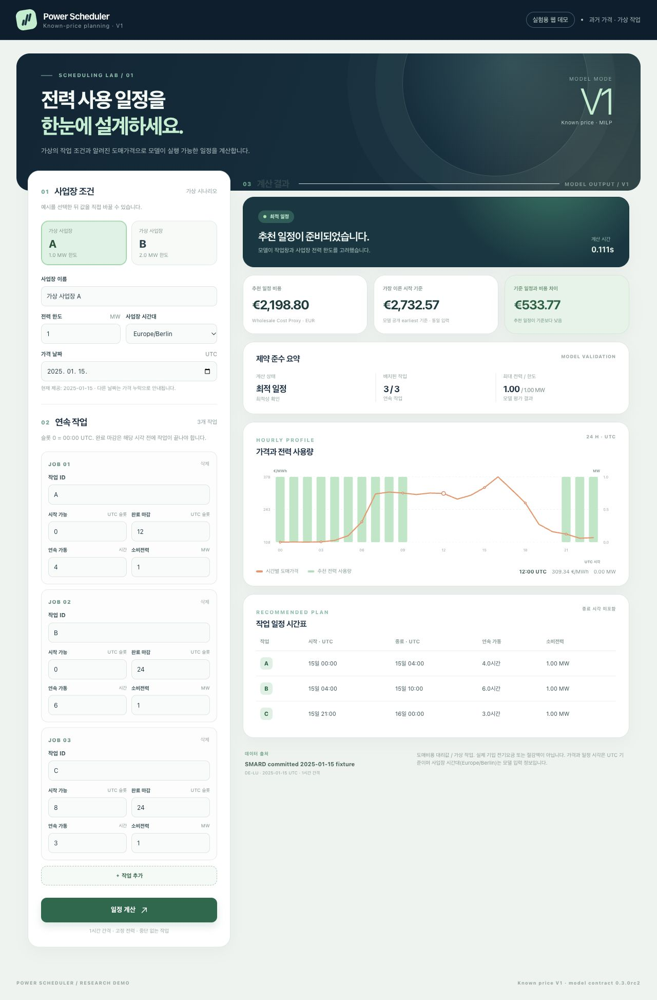
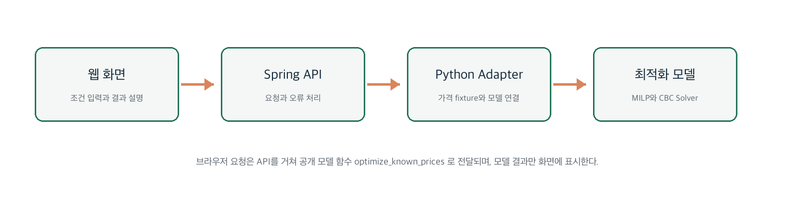
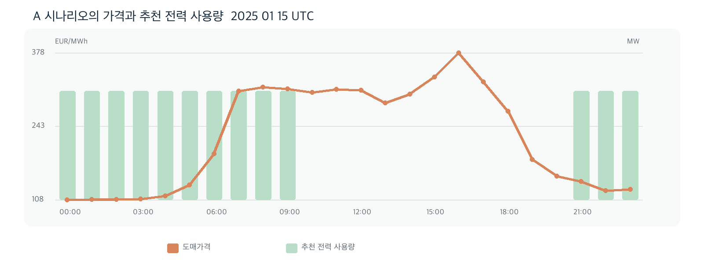

# Power Scheduler

  <strong>작업 제약을 지키면서 전력 사용 시점을 결정하는 웹 기반 일정 의사결정 MVP</strong> 
  React · TypeScript · Spring Boot · Python · MILP

> **공모전 결과물 안내** 
> Power Scheduler는 전기를 단순히 “덜 쓰게” 하는 서비스가 아니라, 마감·연속 가동·사업장 전력 한도를 지키면서 **언제 전력을 사용할지** 결정하도록 돕는 도구입니다. 사용자가 작업 조건을 입력하면, 알려진 시간대별 도매가격 아래에서 실행 가능한 저비용 일정을 계산해 화면에 제안합니다.

| 현재 공개 범위 | 핵심 방식 | 다음 단계 |
| --- | --- | --- |
| 웹 MVP와 실제 로컬 실행 결과 | V1: 알려진 가격 기반 제약 최적화 | V2: 미래 가격 예측 AI 결합 |

## 결과 미리보기

아래는 로컬에서 프런트엔드 → Spring API → Python 어댑터 → 최적화 모델까지 연결해 실행한 **가상 사업장 A**의 실제 화면입니다. 입력 조건과 추천 결과, 24시간 가격·사용량 그래프, 작업 시간표를 한 번에 확인할 수 있습니다.

  

| 시연 조건 | 실행 결과 |
| --- | --- |
| 가상 사업장 A · 전력 상한 1 MW · 연속 작업 3개 | <code>optimal</code> |
| 공개 가격 fixture · 2025-01-15 UTC · 1시간 간격 | 추천 일정 비용 **€2,198.80** |
| 동일 입력의 공개 <code>earliest</code> 기준 일정 | **€2,732.57** |
| 두 일정의 비용 차이 | 추천 일정이 **€533.77 낮음** |

> **중요한 해석** 
> 위 금액은 공개 도매가격과 가상 작업 조건으로 계산한 **Wholesale Cost Proxy**입니다. 실제 기업의 전기요금, 실제 절감액, 매출 성과를 뜻하지 않습니다.

## 어떤 문제를 푸는가

전력 사용량이 큰 작업은 ‘어느 시간에 실행할지’에 따라 비용이 달라질 수 있습니다. 그러나 실제 일정은 가격만 낮은 시간대로 옮길 수 없습니다. 각 작업의 시작 가능 시각·완료 마감·연속 가동시간, 그리고 같은 사업장이 동시에 쓸 수 있는 전력 한도를 함께 지켜야 하기 때문입니다.

Power Scheduler는 다음의 충돌을 한 화면에서 다룹니다.

- **운영 조건**: 작업 ID, 시작 가능 슬롯, 완료 마감, 연속 가동시간, 고정 MW를 입력합니다.
- **사업장 제약**: 모든 작업의 동시 전력 사용량이 사업장 상한을 넘지 않도록 합니다.
- **비용 판단**: 알려진 시간대별 가격을 기준으로 실행 가능한 일정 가운데 낮은 proxy 비용의 일정을 찾습니다.

## 현재 동작 방식

1. 사용자가 가상 사업장과 작업 조건을 선택하거나 직접 수정합니다.
2. 브라우저가 <code>POST /api/v1/schedules/known-price</code>로 회사 조건과 가격 날짜를 전송합니다.
3. Spring Boot API와 Python 어댑터를 거쳐 모델의 공개 <code>optimize_known_prices</code> 함수를 호출합니다.
4. 화면은 계산 상태, 추천 일정, 작업별 시간표, 가격·전력 사용량 그래프, <code>earliest</code> 기준 비교를 표시합니다.

  

프런트엔드는 최적화 수식을 다시 구현하지 않습니다. 입력·표현·오류 안내를 담당하고, 일정 계산의 단일 기준은 별도 모델 패키지에 둡니다.

## 시연 시나리오와 확인 결과

| 시나리오 | 사업장 상한 | 상태 | 확인한 결과 |
| --- | ---: | --- | --- |
| A: 기본 제약 | 1 MW | <code>optimal</code> | €2,198.80 proxy · earliest €2,732.57 · 차이 €533.77 |
| B: 상한 확대 | 2 MW | <code>optimal</code> | €1,506.64 proxy · earliest €2,046.10 |
| 중복 작업 ID | — | <code>INVALID_INPUT</code> | 입력 오류를 별도 안내 |
| 제공되지 않은 가격 날짜 | — | <code>MISSING_PRICE_DATA</code> | 가격 누락을 별도 안내 |
| 1 MW 사업장에 2 MW 작업 | 1 MW | <code>infeasible</code> | 비용을 0으로 표시하지 않고 추천 사용량도 그리지 않음 |
| 모델 어댑터 연결 중단 | — | <code>MODEL_UNAVAILABLE</code> | 모델 연결 오류를 별도 안내 |

<code>earliest</code> 기준은 같은 회사 조건과 같은 가격을 모델의 공개 earliest 방식으로 다시 계산한 비교 기준입니다. 기준 일정이 실행 가능할 때만 차이를 표시합니다.

## 결과를 읽는 법

  

- 주황색 선은 2025-01-15 UTC의 시간별 도매가격입니다.
- 초록색 막대는 모델이 추천한 전력 사용량입니다. A 시나리오에서는 작업 A를 00:00–04:00 UTC, B를 04:00–10:00 UTC, C를 21:00–24:00 UTC에 배치했습니다.
- 그래프는 ‘가격이 낮은 시간대’만 보여 주는 것이 아니라, 각 작업의 마감·연속성·전력 상한을 모두 만족한 결과를 설명합니다.

## V1의 역할과 AI 확장 계획

현재 V1은 미래 가격을 예측하는 AI가 아닙니다. 이미 주어진 가격과 작업 제약 안에서 실행 가능한 일정을 찾는 **의사결정·최적화 엔진**입니다. 따라서 이 저장소의 결과를 ‘실시간 AI 예측’이나 ‘실제 절감 성과’로 표현하지 않습니다.

향후 V2에서는 가격 예측 AI가 미래 시간대별 가격을 제시하고, 검증된 일정 엔진이 그 예측값을 입력으로 받아 계획을 계산하는 구조를 목표로 합니다. 예측 정확도는 과거 구간 검증으로, 비용 효과는 실제 계약요금·운영 제약을 포함한 현장 검증으로 각각 확인해야 합니다.

## 구현 범위와 한계

| 이번 V1에서 구현·확인한 것 | 아직 구현·검증하지 않은 것 |
| --- | --- |
| A/B 시나리오, 작업 조건 직접 수정, 상태별 결과 화면 | 실제 기업 전기요금과 실제 절감 성과 |
| 가격·전력 사용량 그래프, 작업 시간표, earliest 비교 | 실시간 가격, 다일 가격, 15분 단위 입력 |
| 입력 오류·가격 누락·실행 불가능·연결 오류의 구분 | 인증, 저장, 권한, 배포 |
| 입력 변경 시 기존 결과 숨김 및 진행 요청 취소 | V2 가격 예측 AI와 V3 이후 재계산 |

현재 가격 데이터는 모델 checkout에 포함된 **SMARD committed 2025-01-15 UTC** 하루의 24개 시간 슬롯이며, 사업장과 작업은 모두 가상입니다.

---

이 README의 화면과 수치는 로컬 연동 환경에서 확인한 V1 데모 결과입니다. 공개 저장소에서는 결과·동작 범위·한계를 먼저 확인할 수 있도록 구성했습니다.
